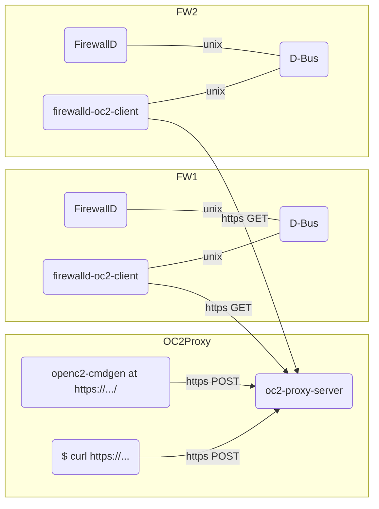

# Controlling FirewallD as OpenC2 actuator

This is a test of standard under development, provided for illustration purposes only.
No warranty whatsoever.

## Running environment

## Command-line options

### `go run github.com/korc/openc2-firewalld/cmd/oc2-proxy-server`

- `-listen string`
    Listen address (default "localhost:1512")
- `-cert string`
    Server certificate (default "server.crt"). Specifying "" will use HTTP instead of HTTPS.
- `-key string`
    Private key for certificate (default "server.key")
- `-cacert string`
    Client CA certificate (default "ca.crt")
- `-path string`
    URL path to OpenC2 endpoint (default "/oc2")
- `-www string`
    Path to static html pages (ex: a copy of [`openc2-cmdgen`](https://github.com/netcoredor/openc2-cmdgen))

### `go run github.com/korc/openc2-firewalld/cmd/firewalld-oc2-client`

- `-cert string`
    Client X509 certificate (default "client.crt")
- `-id string`
    Asset ID to use
- `-interval float`
    wait interval in seconds (default 10)
- `-key string`
    Private key for x509 certificate (default "client.key")
- `-server string`
    OpenC2 server URL (default "http://localhost:1512/oc2")
- `-zone string`
    Zone to manipulate (default "public")

### `test/gen-certs.sh`

- No options
- generates `server`, `client` and `ca` PEM-encoded `.crt` and `.key` files.
- `client.crt` will be signed by `ca.crt`.
- `xxx.tmpl` contain templates for certificates.
